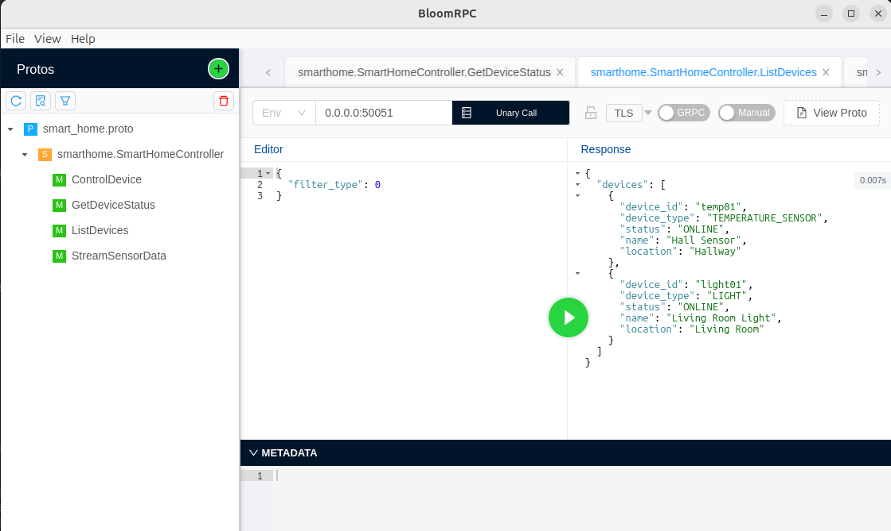

# smarthome-grpc-controller (C++17 & gRPC)
- A Modular and Extensible Smart Home Device Management System using gRPC and Protocol Buffers.

---

## Overview
- Implements a gRPC-based smart home controller system
- Supports communication between a central controller and various smart devices such as lights, thermostats, door lock, sensors
- Modular architecture separating interface definitions, business logic, and transport layers
- Designed for flexible integration of new devices

---

## Features
- Modular smart device abstraction using C++17 classes
- gRPC service for remote control and monitoring
- Protobuf-based schema definition for device commands and status
- Easy-to-extend structure for additional device types
- Sample implementation for lighting, climate, sensor, door lock devices
- Includes server and client

---

## Directory Structure
```
smarthome-grpc-controller/
├── proto/                     # gRPC service and message definitions (smart_home.proto)
├── src/
│   ├── client/                # CLI client implementation
│   ├── server/                # gRPC server and service logic
│   └── devices/
│       ├── base/              # Abstract interfaces and shared types
│       ├── light/             # Light device implementations
│       └── climate/           # Climate (thermostat/sensor) devices
│       └── security/          # Security device implementations
│       └── sensor/            # Sensor device implementations
├── CMakeLists.txt             # CMake build script
├── README.md
```

---

## Getting Started
### Prerequisites
- Linux (Ubuntu 20.04 or later recommended)
- Requires CMake 3.14 or later
- Requires C++17 compatible compiler
- [gRPC](https://github.com/grpc/grpc) (included as a submodule)
- [protobuf](https://github.com/protocolbuffers/protobuf) (included as a submodule)
- [spdlog](https://github.com/gabime/spdlog) (included as a submodule)
- [BloomRPC](https://github.com/bloomrpc/bloomrpc/releases) (useful for testing .proto files included as a project)

### Build Instructions
```bash
# Update package lists
sudo apt update

# Clone the repository
git clone https://github.com/loki2001-dev/smarthome-grpc-controller.git
cd smarthome-grpc-controller

# Initialize submodules
git submodule update --init --recursive

# Install dependencies and build Protobuf/gRPC
. install_grpc.sh

# Build the project
. build_project.sh
```

---

### Test Image
